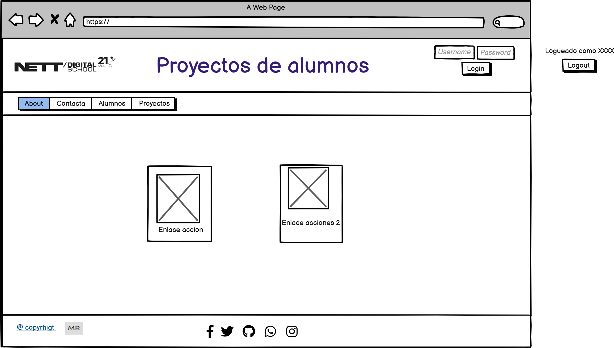
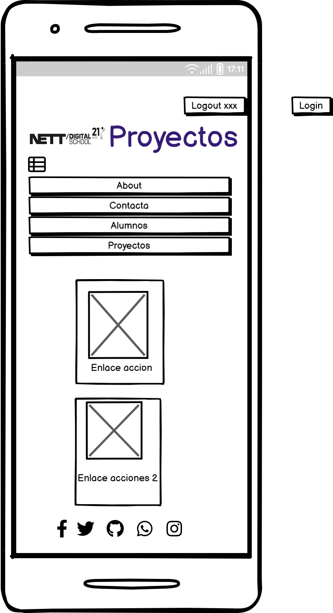

# Proyecto base

Creamos un diseño de aplicación siguiendo las especificaciones vistas en las tutorías

Para el diseño de pantallas usamos ***componenetes*** por lo tanto serán ficheros ubicados en la carpeta ***resources/views/components***.
Dentro de ella hemos creado una carpeta llamada ***layout*** dónde están los diferentes layouts.
Ahí vemos los 4 componentes creados como base.
Las imágenes están optimizadas en la página
 Optimizar imágenes para la web https://tinypng.com/ (ver referencias en los apuntes).

